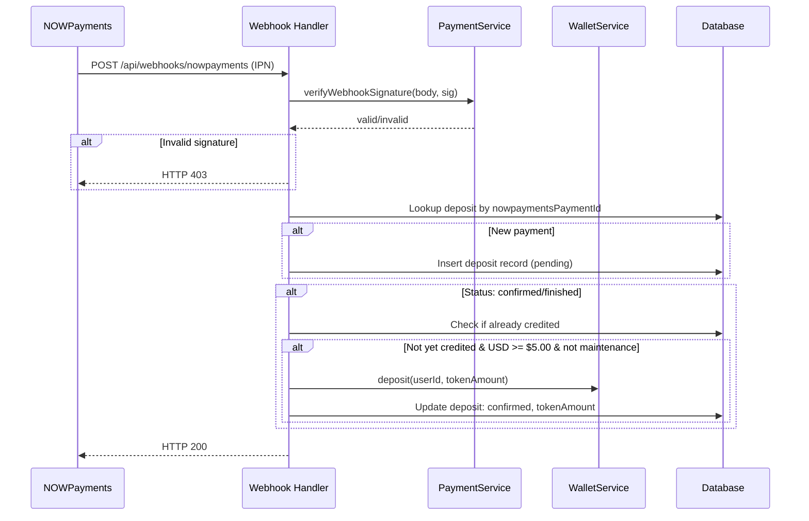

# Design Document: Crypto Payments

## Overview

This feature replaces the demo deposit/withdrawal system with real cryptocurrency payments via the NOWPayments REST API. The integration covers two primary flows:

1. **Deposits**: Each user gets a permanent USDC (Solana) deposit address from NOWPayments. When funds arrive on-chain, NOWPayments sends a webhook (IPN callback) to our backend, which verifies the signature, converts the confirmed USD value to tokens (×100), and credits the user's internal wallet balance.

2. **Withdrawals**: Users request a withdrawal by specifying a token amount and their Solana wallet address. The backend validates the request (minimum amount, sufficient balance, daily rate limit, valid address format), deducts tokens + a flat 50-token fee, and calls the NOWPayments Payout API to send USDC to the user's address.

The internal token system (100 tokens = $1.00 USD), the wallet/escrow pipeline, and the wager settlement flow remain completely unchanged. Only the deposit and withdrawal entry/exit points are replaced.

### Key Design Decisions

1. **PaymentService as a new service** — A new `PaymentService` class in `src/services/payment.ts` encapsulates all NOWPayments API interactions (address provisioning, payout initiation, webhook verification). This keeps the existing `WalletService` focused on internal balance operations and avoids coupling it to an external API.

2. **Webhook-driven deposits** — Deposits are entirely webhook-driven. The user sends crypto to their permanent address; NOWPayments notifies us via IPN callback. There is no "create payment" step on our side — the permanent address handles repeat deposits automatically.

3. **HMAC-SHA512 webhook verification** — Every incoming webhook is verified by sorting the payload keys alphabetically, computing HMAC-SHA512 with the IPN secret, and comparing against the `x-nowpayments-sig` header. This follows the NOWPayments IPN specification exactly.

4. **Idempotency via NOWPayments payment ID** — The `nowpaymentsPaymentId` column has a unique index. Before crediting a balance, the webhook handler checks if a deposit record with status "confirmed" already exists for that payment ID. This prevents double-credits from webhook retries.

5. **Maintenance mode with queued processing** — When maintenance mode is enabled, webhooks are still accepted and stored (deposit records created/updated) but balance credits are deferred. When maintenance mode is disabled, a processing function replays all "confirming"/"confirmed"-but-uncredited deposits.

6. **Solana address validation via regex** — Solana wallet addresses are base58-encoded strings of 32–44 characters. A regex check is sufficient for format validation without requiring a Solana SDK dependency.

7. **Reuse existing transaction types** — The existing `transactionTypeEnum` already has "deposit" and "withdrawal" types. We add two new values: "deposit_credit" and "withdrawal_fee" to distinguish crypto-specific operations, or reuse existing types with descriptive metadata in the `description` column.

8. **user_payment_profiles table** — Rather than adding nullable columns to the `users` table, a separate `user_payment_profiles` table stores the NOWPayments deposit address and saved withdrawal address. This keeps the users table clean and allows the web app's mirrored schema to remain unchanged for non-payment queries.

## Architecture

```mermaid
flowchart TD
    subgraph "Deposit Flow"
        A[User visits Wallet Page] --> B{Deposit address exists?}
        B -->|No| C[PaymentService.getOrCreateDepositAddress]
        C --> D[POST NOWPayments /sub-partner/balance]
        D --> E[Store address in user_payment_profiles]
        B -->|Yes| F[Display address + QR code]
        E --> F

        G[User sends USDC to address] --> H[NOWPayments detects on-chain tx]
        H --> I[NOWPayments sends IPN webhook]
        I --> J[POST /api/webhooks/nowpayments]
        J --> K{Verify HMAC signature}
        K -->|Invalid| L[HTTP 403 + log]
        K -->|Valid| M{Payment status?}
        M -->|confirming| N[Upsert deposit record: confirming]
        M -->|confirmed/finished| O{Already credited?}
        O -->|Yes| P[HTTP 200, skip]
        O -->|No| Q{USD >= $5.00 minimum?}
        Q -->|No| R[Mark confirmed, log sub-minimum, skip credit]
        Q -->|Yes| S{Maintenance mode?}
        S -->|Yes| T[Mark confirmed, queue for later]
        S -->|No| U[WalletService.deposit + mark confirmed]
        M -->|failed/expired| V[Update deposit: failed]
    end

    subgraph "Withdrawal Flow"
        W[User submits withdrawal form] --> X[POST /api/wallet/withdraw]
        X --> Y{Maintenance mode?}
        Y -->|Yes| Z[Reject: system under maintenance]
        Y -->|No| AA{Validate request}
        AA -->|Fail| AB[Return validation error]
        AA -->|Pass| AC[Deduct tokens + fee from balance]
        AC --> AD[Create withdrawal record: pending]
        AD --> AE[POST NOWPayments Payout API]
        AE --> AF{API response?}
        AF -->|Success| AG[Update withdrawal: processing]
        AF -->|Error| AH[Update withdrawal: failed]
        AH --> AI[Refund tokens + fee to balance]
    end
```



### Component Interaction — Deposit Webhook



## Components and Interfaces

### 1. PaymentService (`src/services/payment.ts`)

New service handling all NOWPayments API interactions:

```typescript
interface DepositAddressResult {
  address: string;
  currency: string;  // "usdcsol"
}

interface WithdrawalResult {
  withdrawalId: string;
  nowpaymentsPayoutId: string | null;
  status: "pending" | "processing" | "failed";
  error?: string;
}

class PaymentService {
  // Get or create a permanent deposit address for a user
  async getOrCreateDepositAddress(userId: string): Promise<DepositAddressResult>;

  // Verify webhook HMAC signature
  verifyWebhookSignature(body: Record<string, unknown>, signature: string): boolean;

  // Process an incoming deposit webhook payload
  async processDepositWebhook(payload: NowPaymentsWebhookPayload): Promise<void>;

  // Initiate a withdrawal via NOWPayments Payout API
  async initiateWithdrawal(userId: string, tokenAmount: number, destinationAddress: string): Promise<WithdrawalResult>;

  // Validate a Solana wallet address format
  validateSolanaAddress(address: string): boolean;

  // Check daily withdrawal count for a user
  async getDailyWithdrawalCount(userId: string): Promise<number>;

  // Process queued deposits after maintenance mode is disabled
  async processQueuedDeposits(): Promise<number>;

  // Check if maintenance mode is active
  isMaintenanceMode(): boolean;
}
```

### 2. Webhook Handler (`web/src/app/api/webhooks/nowpayments/route.ts`)

New Next.js API route that receives NOWPayments IPN callbacks:

- Reads raw request body for signature verification
- Calls `PaymentService.verifyWebhookSignature()`
- Calls `PaymentService.processDepositWebhook()`
- Returns HTTP 200 promptly on success, HTTP 403 on signature failure

### 3. Updated Withdrawal Route (`web/src/app/api/wallet/withdraw/route.ts`)

Replaces the current mock withdrawal with real validation and NOWPayments payout:

- Validates minimum amount (1000 tokens), sufficient balance (amount + 50-token fee), valid Solana address, daily limit (3/day)
- Calls `PaymentService.initiateWithdrawal()`
- Returns withdrawal status and ID

### 4. Deposit Address API Route (`web/src/app/api/wallet/deposit-address/route.ts`)

New API route that returns the user's permanent deposit address:

- Calls `PaymentService.getOrCreateDepositAddress()`
- Returns address string for display and QR code generation

### 5. Updated Wallet Page (`web/src/app/wallet/`)

Complete UI replacement:

- **Deposit tab**: Shows permanent address, QR code, minimum deposit notice, supported currencies
- **Withdrawal tab**: Form with token amount, Solana address (pre-filled from saved), fee display, daily limit counter
- **Transaction history**: Combined view of deposits, withdrawals, wager activity with status indicators
- **Maintenance banner**: Shown when maintenance mode is active

### 6. WalletService Extensions (`src/services/wallet.ts`)

Minor additions to the existing service:

- `depositFromCrypto(userId, tokenAmount, depositId)` — credits balance and logs transaction with deposit reference
- `withdrawForCrypto(userId, tokenAmount, fee, withdrawalId)` — deducts balance + fee, logs both transactions
- `refundFailedWithdrawal(userId, tokenAmount, fee, withdrawalId)` — restores balance + fee on payout failure

### 7. Environment Configuration

| Variable | Default | Description |
|----------|---------|-------------|
| `NOWPAYMENTS_API_KEY` | (required) | NOWPayments API key |
| `NOWPAYMENTS_IPN_SECRET` | (required) | IPN webhook signing secret |
| `NOWPAYMENTS_API_URL` | `https://api.nowpayments.io/v1` | API base URL |
| `MIN_DEPOSIT_TOKENS` | `500` | Minimum deposit in tokens ($5.00) |
| `MIN_WITHDRAWAL_TOKENS` | `1000` | Minimum withdrawal in tokens ($10.00) |
| `WITHDRAWAL_FEE_TOKENS` | `50` | Flat withdrawal fee in tokens ($0.50) |
| `MAX_DAILY_WITHDRAWALS` | `3` | Max withdrawals per user per UTC day |
| `MAINTENANCE_MODE` | `false` | Pause deposits/withdrawals |

## Data Models

### New Tables

#### `deposits` table

```typescript
export const depositStatusEnum = pgEnum("deposit_status", [
  "pending",
  "confirming",
  "confirmed",
  "failed",
]);

export const deposits = pgTable("deposits", {
  id: text("id").primaryKey(),                                    // nanoid
  userId: text("user_id").notNull().references(() => users.id),
  nowpaymentsPaymentId: text("nowpayments_payment_id").notNull().unique(),
  sourceCurrency: text("source_currency"),                        // "usdcsol", "btc", etc.
  sourceAmount: text("source_amount"),                            // amount in source currency
  usdValue: text("usd_value"),                                    // confirmed USD value
  tokenAmount: bigint("token_amount", { mode: "number" }),        // tokens credited (null if not yet credited)
  status: depositStatusEnum("status").notNull().default("pending"),
  credited: integer("credited").notNull().default(0),             // 0 = not credited, 1 = credited
  maintenanceQueued: integer("maintenance_queued").notNull().default(0), // 1 = queued during maintenance
  createdAt: timestamp("created_at").notNull().defaultNow(),
  updatedAt: timestamp("updated_at").notNull().defaultNow(),
}, (table) => [
  index("idx_deposits_user").on(table.userId),
  uniqueIndex("idx_deposits_payment_id").on(table.nowpaymentsPaymentId),
]);
```

#### `withdrawals` table

```typescript
export const withdrawalStatusEnum = pgEnum("withdrawal_status", [
  "pending",
  "processing",
  "completed",
  "failed",
]);

export const withdrawals = pgTable("withdrawals", {
  id: text("id").primaryKey(),                                    // nanoid
  userId: text("user_id").notNull().references(() => users.id),
  nowpaymentsPayoutId: text("nowpayments_payout_id"),             // nullable until API responds
  tokenAmount: bigint("token_amount", { mode: "number" }).notNull(),
  withdrawalFee: bigint("withdrawal_fee", { mode: "number" }).notNull(),
  usdValue: text("usd_value").notNull(),                          // USD equivalent
  destinationAddress: text("destination_address").notNull(),
  status: withdrawalStatusEnum("status").notNull().default("pending"),
  createdAt: timestamp("created_at").notNull().defaultNow(),
  updatedAt: timestamp("updated_at").notNull().defaultNow(),
}, (table) => [
  index("idx_withdrawals_user").on(table.userId),
]);
```

#### `user_payment_profiles` table

```typescript
export const userPaymentProfiles = pgTable("user_payment_profiles", {
  id: text("id").primaryKey(),                                    // nanoid
  userId: text("user_id").notNull().references(() => users.id).unique(),
  nowpaymentsDepositAddress: text("nowpayments_deposit_address"),
  savedWithdrawalAddress: text("saved_withdrawal_address"),
  createdAt: timestamp("created_at").notNull().defaultNow(),
  updatedAt: timestamp("updated_at").notNull().defaultNow(),
});
```

### Transaction Type Extensions

Add two new values to the existing `transactionTypeEnum`:

```typescript
export const transactionTypeEnum = pgEnum("transaction_type", [
  "deposit",
  "withdrawal",
  "escrow_lock",
  "escrow_release",
  "wager_win",
  "wager_refund",
  "platform_fee",
  "deposit_credit",    // NEW: crypto deposit credited
  "withdrawal_fee",    // NEW: flat withdrawal fee
]);
```

### Web App Schema Mirror (`web/src/lib/user.ts`)

Add mirrored table definitions for `deposits`, `withdrawals`, and `userPaymentProfiles` so the wallet page can query them directly.


## Correctness Properties

*A property is a characteristic or behavior that should hold true across all valid executions of a system — essentially, a formal statement about what the system should do. Properties serve as the bridge between human-readable specifications and machine-verifiable correctness guarantees.*

### Property 1: Deposit address provisioning is idempotent

*For any* user ID, calling `getOrCreateDepositAddress` multiple times SHALL always return the same address. The NOWPayments API SHALL be called at most once per user — on the first invocation when no address exists. Subsequent calls SHALL return the stored address without an API call.

**Validates: Requirements 1.1, 1.2**

### Property 2: Webhook HMAC signature verification

*For any* webhook request body and IPN secret, the signature verification function SHALL return true if and only if the HMAC-SHA512 of the sorted-by-key JSON body (using the IPN secret as key) matches the provided `x-nowpayments-sig` header value. For any body with a mismatched or missing signature, verification SHALL return false.

**Validates: Requirements 2.1, 2.2, 7.1**

### Property 3: USD-to-token conversion credits full value

*For any* confirmed deposit with a USD value, the token amount credited to the user SHALL equal `Math.floor(usdValue * 100)`. The platform absorbs the NOWPayments deposit fee, so the conversion is based on the full confirmed USD value, not the USD value minus any fee.

**Validates: Requirements 2.3, 2.8**

### Property 4: Webhook processing is idempotent

*For any* valid webhook payload with a given NOWPayments payment ID, processing the webhook N times (N ≥ 1) SHALL credit the user's balance exactly once. The deposit record's `credited` flag and the unique index on `nowpaymentsPaymentId` SHALL prevent duplicate credits regardless of how many times the webhook is delivered.

**Validates: Requirements 2.4, 3.2, 7.3**

### Property 5: Deposit status transitions and minimum enforcement

*For any* valid webhook payload, the deposit record status SHALL transition according to the payment status: "confirming" → deposit record updated to "confirming" with no balance credit; "confirmed"/"finished" with USD value ≥ $5.00 → deposit record updated to "confirmed" with balance credited; "confirmed"/"finished" with USD value < $5.00 → deposit record updated to "confirmed" with no balance credit; "failed"/"expired" → deposit record updated to "failed" with no balance credit. In no case SHALL a non-"confirmed"/"finished" status result in a balance credit.

**Validates: Requirements 2.5, 2.6, 8.1**

### Property 6: Withdrawal validation

*For any* withdrawal request with token amount A, user available balance B, destination address D, and daily withdrawal count C, the request SHALL be accepted if and only if all of the following hold: A ≥ 1000 (minimum withdrawal), B ≥ A + 50 (sufficient balance including fee), D is a valid Solana address (base58, 32–44 characters), and C < 3 (daily limit not exceeded). If any condition fails, the request SHALL be rejected with a descriptive error and no balance change SHALL occur.

**Validates: Requirements 4.1, 4.2, 4.3, 4.4, 4.5, 9.1**

### Property 7: Withdrawal balance deduction

*For any* valid withdrawal of token amount A, the user's available balance SHALL decrease by exactly A + 50 (the withdrawal amount plus the flat withdrawal fee). A withdrawal record SHALL be created with status "pending", and two transaction records SHALL be logged: one for the withdrawal amount and one for the fee.

**Validates: Requirements 4.6, 4.7, 14.2, 14.3**

### Property 8: Failed withdrawal full refund

*For any* withdrawal that fails (either the NOWPayments Payout API returns an error, or a subsequent webhook/poll indicates failure), the user's available balance SHALL be restored by exactly the withdrawal amount plus the withdrawal fee (A + 50). The withdrawal record status SHALL be updated to "failed". The net balance effect of a failed withdrawal SHALL be zero.

**Validates: Requirements 5.3, 5.5**

### Property 9: Withdrawal address persistence

*For any* sequence of withdrawals by a user with destination addresses [A₁, A₂, ..., Aₙ], the user's saved withdrawal address SHALL always equal the most recently used address Aₙ. Each new withdrawal with a different address SHALL overwrite the previously stored address.

**Validates: Requirements 6.2, 6.4**

### Property 10: Maintenance mode behavior

*For any* set of deposit webhooks and withdrawal requests arriving while maintenance mode is enabled: all deposit webhooks SHALL be accepted and stored (deposit records created/updated) but no user balances SHALL be credited; all withdrawal requests SHALL be rejected. When maintenance mode is subsequently disabled, all queued confirmed deposits (USD ≥ $5.00) SHALL be processed and user balances credited. The total tokens credited after queue processing SHALL equal the sum of `Math.floor(usdValue * 100)` for each qualifying queued deposit.

**Validates: Requirements 10.2, 10.3, 10.4**

### Property 11: Transaction audit trail completeness

*For any* sequence of crypto deposit credits and withdrawal operations, every balance change SHALL have a corresponding transaction record. Specifically: each deposit credit SHALL produce a transaction of type "deposit_credit" with positive amount equal to the tokens credited; each withdrawal SHALL produce a transaction of type "withdrawal" with negative amount; each withdrawal fee SHALL produce a transaction of type "withdrawal_fee". The sum of all transaction amounts for a user SHALL equal their net balance change from crypto operations.

**Validates: Requirements 14.1, 14.2, 14.3, 14.4**

## Error Handling

### Deposit Errors

| Error Condition | Response | Side Effects |
|----------------|----------|--------------|
| NOWPayments API fails to create deposit address | Return error message, prompt retry | No address stored |
| Webhook signature invalid | HTTP 403 | Log failed verification |
| Webhook payment ID not linked to known user | HTTP 200 (accept but skip) | Log unknown payment |
| Deposit USD value below $5.00 minimum | Mark confirmed, skip credit | Log sub-minimum deposit |
| Duplicate webhook (already credited) | HTTP 200 (accept, skip credit) | No balance change |
| Maintenance mode active during webhook | Store deposit, queue for later | No immediate balance credit |

### Withdrawal Errors

| Error Condition | Response | Side Effects |
|----------------|----------|--------------|
| Amount below 1000 tokens | 400: "Minimum withdrawal is 1000 tokens ($10.00)" | None |
| Insufficient balance (amount + fee) | 400: "Insufficient balance. Available: X, need: Y" | None |
| Invalid Solana address format | 400: "Invalid Solana wallet address" | None |
| Daily limit exceeded (3/day) | 400: "Daily withdrawal limit reached. Resets at midnight UTC" | None |
| Maintenance mode active | 503: "System under maintenance. Deposits and withdrawals are temporarily paused" | None |
| NOWPayments Payout API error | Update withdrawal to "failed" | Refund full amount + fee |
| Payout fails after initial acceptance | Update withdrawal to "failed" | Refund full amount + fee |

### Graceful Degradation

If required NOWPayments environment variables (`NOWPAYMENTS_API_KEY`, `NOWPAYMENTS_IPN_SECRET`) are missing at startup, the `PaymentService` logs an error and sets an internal `disabled` flag. All deposit address requests and withdrawal initiations return a "Crypto payments are not configured" error. The rest of the platform (wagers, freeplay, escrow) continues to function normally.

## Testing Strategy

### Property-Based Tests

Property-based testing is appropriate for this feature because the core logic involves:
- Pure validation functions (address format, amount checks, rate limits)
- Balance arithmetic with invariants (deductions, refunds, conversions)
- Idempotency guarantees (webhook replay, address provisioning)
- State machine transitions (deposit status lifecycle)

**Library:** [fast-check](https://github.com/dubzzz/fast-check) (already a dev dependency)

**Configuration:**
- Minimum 100 iterations per property test
- Each test tagged with: `Feature: crypto-payments, Property {N}: {title}`

**Properties to implement:**
- Property 1: Deposit address provisioning idempotency
- Property 2: Webhook HMAC signature verification
- Property 3: USD-to-token conversion
- Property 4: Webhook processing idempotency
- Property 5: Deposit status transitions and minimum enforcement
- Property 6: Withdrawal validation
- Property 7: Withdrawal balance deduction
- Property 8: Failed withdrawal full refund
- Property 9: Withdrawal address persistence
- Property 10: Maintenance mode behavior
- Property 11: Transaction audit trail completeness

### Unit Tests (Example-Based)

- Wallet page renders deposit address and QR code (Req 1.3)
- Minimum deposit notice displayed (Req 1.4)
- Supported currencies notice displayed (Req 1.5)
- API failure returns descriptive error (Req 1.6)
- Webhook logs payload for audit (Req 2.7)
- Wallet page shows deposit list with status (Req 3.3)
- Withdrawal form pre-fills saved address (Req 6.3)
- HTTP 200 returned for valid webhooks (Req 7.2)
- Sub-minimum deposit logged for review (Req 8.2)
- Rate limit error message includes reset time (Req 9.2)
- Remaining withdrawal attempts displayed (Req 9.3)
- Maintenance banner displayed (Req 10.5)
- Demo/test references removed from wallet page (Req 12.5)
- Missing env vars disable payments gracefully (Req 13.4)
- Withdrawal fee transaction has descriptive label (Req 14.3)

### Integration Tests

- End-to-end deposit flow: webhook → deposit record → balance credit
- End-to-end withdrawal flow: request → validation → payout API → record update
- Maintenance mode toggle: enable → queue deposits → disable → process queue
- Schema migration: verify all new tables and columns exist
- Transaction history query returns mixed deposit/withdrawal/wager records
