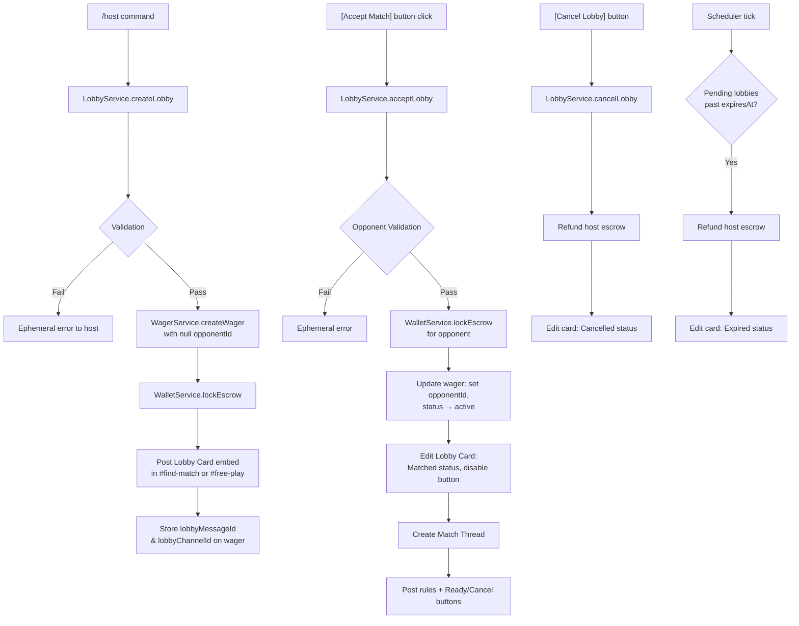
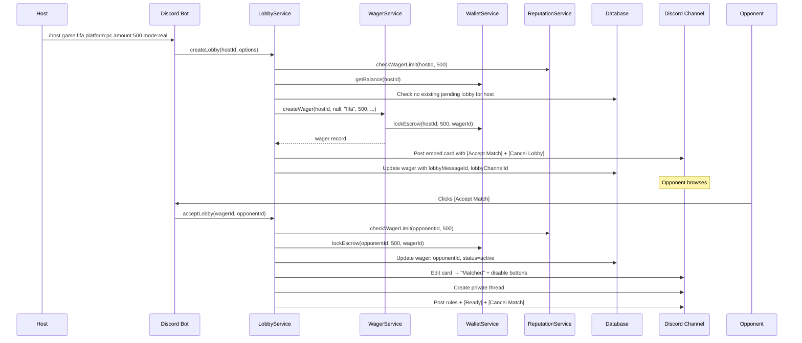

# Design Document: Host Wager Lobby

## Overview

The Host Wager Lobby feature adds an open marketplace model to MATCHPOINT where players create open wager lobbies via `/host` instead of targeting specific opponents. Lobbies are posted as Discord embed cards in `#find-match` (real money) or `#free-play` (freeplay) channels. Any eligible player can accept by clicking a button on the card. Once accepted, the flow merges into the existing match pipeline (thread creation → ready → play → report → settle).

The design extends the existing `wagers` table with lobby-specific metadata columns, introduces a `LobbyService` that orchestrates creation/validation/expiry, and adds new button handlers for lobby accept, cancel, and the modified match thread flow. The scheduler is extended to handle lobby expiry with card updates.

### Key Design Decisions

1. **Reuse the wagers table** — Lobby-created wagers share the same data model as direct-challenge wagers. Lobby metadata is stored in new nullable columns. This avoids a separate `lobbies` table and ensures the settlement pipeline works unchanged.

2. **Slash command with select menus** — Discord modals only support 5 text inputs and cannot contain select menus. The `/host` command uses slash command options for game, platform, amount, and mode (required), with optional string options for game mode, team size, rules notes, and rounds format. This keeps the UX within a single command invocation.

3. **LobbyService wraps WagerService** — `LobbyService` handles lobby-specific logic (validation, card posting, expiry, cancel) but delegates wager record creation and escrow to the existing `WagerService` and `WalletService`. After acceptance, the flow hands off to the existing button handlers in `buttons.ts`.

4. **Scheduler-based expiry** — The existing `Scheduler` tick loop is extended with a `expireLobbies()` method that finds pending lobbies past their `expiresAt` timestamp, refunds escrow, and edits the lobby card embed to show "Expired" status.

5. **Card editing via stored message/channel IDs** — The wager record stores `lobbyMessageId` and `lobbyChannelId` so the bot can edit or disable the lobby card embed when the lobby is accepted, cancelled, or expired.

## Architecture



### Component Interaction Flow



## Components and Interfaces

### 1. `/host` Slash Command (`src/bot/commands.ts`)

New slash command registration added to the `commands` array:

```typescript
new SlashCommandBuilder()
  .setName("host")
  .setDescription("Host an open wager lobby")
  .addStringOption(opt => opt.setName("game").setDescription("Game to play").setRequired(true)
    .addChoices(
      { name: "FIFA / EA FC", value: "fifa" },
      { name: "League of Legends", value: "lol" },
      { name: "Valorant", value: "valorant" },
      { name: "Rocket League", value: "rocketleague" },
      { name: "Call of Duty", value: "cod" },
      { name: "Fortnite", value: "fortnite" },
      { name: "Other", value: "other" },
    ))
  .addStringOption(opt => opt.setName("platform").setDescription("Platform").setRequired(true)
    .addChoices(
      { name: "PC", value: "pc" },
      { name: "Xbox", value: "xbox" },
      { name: "PlayStation", value: "playstation" },
      { name: "Cross-Platform", value: "crossplay" },
    ))
  .addIntegerOption(opt => opt.setName("amount").setDescription("Tokens to wager").setRequired(true).setMinValue(10))
  .addStringOption(opt => opt.setName("mode").setDescription("Real or freeplay").setRequired(true)
    .addChoices(
      { name: "Real Money", value: "real" },
      { name: "Freeplay", value: "freeplay" },
    ))
  .addStringOption(opt => opt.setName("game_mode").setDescription("Game mode (e.g., 1v1, 2v2)"))
  .addStringOption(opt => opt.setName("team_size").setDescription("Team size"))
  .addStringOption(opt => opt.setName("rules_notes").setDescription("Custom rules or notes"))
  .addStringOption(opt => opt.setName("rounds_format").setDescription("Rounds format (e.g., Bo3, Bo5)"))
```

### 2. LobbyService (`src/services/lobby.ts`)

New service that orchestrates lobby lifecycle:

```typescript
interface LobbyOptions {
  hostId: string;          // internal user ID
  game: string;
  platform: string;
  amount: number;
  mode: "real" | "freeplay";
  gameMode?: string;
  teamSize?: string;
  rulesNotes?: string;
  roundsFormat?: string;
  guildId?: string;
}

interface LobbyCard {
  wagerId: string;
  messageId: string;
  channelId: string;
}

class LobbyService {
  // Create a lobby: validate host, create wager, lock escrow, post card
  async createLobby(options: LobbyOptions): Promise<LobbyCard>;

  // Accept a lobby: validate opponent, lock escrow, update wager, edit card
  async acceptLobby(wagerId: string, opponentId: string, guildId: string): Promise<void>;

  // Host cancels their pending lobby
  async cancelLobby(wagerId: string, userId: string): Promise<void>;

  // Called by scheduler when lobby expires
  async expireLobby(wagerId: string): Promise<void>;

  // Build the Discord embed for a lobby card
  buildLobbyEmbed(wager: Wager, hostUser: User, status: "open" | "matched" | "expired" | "cancelled"): EmbedBuilder;

  // Check if a user already has an active pending lobby
  async hasActiveLobby(userId: string): Promise<boolean>;
}
```

### 3. Lobby Button Handlers (`src/bot/buttons.ts` extension)

New button action handlers added to the existing `handleButton` switch:

- `accept_lobby:{wagerId}` — Opponent clicks Accept Match on a lobby card
- `cancel_lobby:{wagerId}` — Host clicks Cancel Lobby on their pending card
- `cancel_match:{wagerId}` — Either player clicks Cancel Match in the thread before both ready

The `accept_lobby` handler calls `LobbyService.acceptLobby()`, creates the match thread, and posts the Ready + Cancel Match buttons. After both players click Ready, the existing `onReady` flow takes over.

### 4. `/host` Command Handler (`src/bot/handler.ts` extension)

New `handleHost` case in the command switch that:
1. Extracts all options from the interaction
2. Calls `LobbyService.createLobby()`
3. Replies with an ephemeral confirmation to the host

### 5. Scheduler Extension (`src/services/scheduler.ts`)

New `expireLobbies()` method in the tick loop:
- Queries pending wagers where `expiresAt <= now` AND `lobbyMessageId IS NOT NULL`
- For each: calls `LobbyService.expireLobby()` which refunds escrow and edits the card

### 6. Lobby Card Embed Builder

The lobby card is a Discord `EmbedBuilder` with:
- Color: gold (open), green (matched), grey (expired), red (cancelled)
- Title: `{game} — {platform}` 
- Fields: Amount, Host (with rep badge), Game Mode, Team Size, Rounds, Expiry countdown
- Footer: Rules from GameProfile
- Action row: [Accept Match] button + [Cancel Lobby] button (cancel only visible to host via ephemeral check)

Since Discord buttons cannot be conditionally shown per-user, the [Cancel Lobby] button is included for all users but the handler checks `interaction.user.id === host.discordId` and returns an ephemeral error if a non-host clicks it.

### 7. Match Thread with Cancel Support

When a lobby is accepted, the thread is created with:
- Match details message (both players, amount, rules)
- [Ready] button + [Cancel Match] button in the same action row
- Once both players click Ready, the [Cancel Match] button is removed and the existing match flow continues

The `cancel_match` handler:
1. Checks fewer than 2 players have clicked Ready
2. Calls `WagerService.refundWager()` to refund both players
3. Posts cancellation message identifying who cancelled
4. Archives the thread

## Data Models

### Wager Table Extensions

New nullable columns added to the `wagers` table in `src/db/schema.ts`:

```typescript
// Lobby-specific metadata
platform: text("platform"),                    // "pc", "xbox", "playstation", "crossplay"
gameMode: text("game_mode"),                   // "1v1", "2v2", etc.
teamSize: text("team_size"),                   // "solo", "duo", etc.
rulesNotes: text("rules_notes"),               // free-text custom rules
roundsFormat: text("rounds_format"),           // "Bo1", "Bo3", "Bo5"
lobbyMessageId: text("lobby_message_id"),      // Discord message ID of the lobby card
lobbyChannelId: text("lobby_channel_id"),      // Discord channel ID where card was posted
```

These columns are nullable so existing direct-challenge wagers are unaffected. The `opponentId` column is already nullable in the schema, which supports lobby wagers where the opponent is unknown at creation time.

### Lobby Card Status Colors

| Status    | Embed Color | Button State                |
|-----------|-------------|-----------------------------|
| Open      | Gold (#FFD700) | Accept Match + Cancel Lobby enabled |
| Matched   | Green (#00FF00) | All buttons disabled        |
| Expired   | Grey (#808080) | All buttons disabled         |
| Cancelled | Red (#FF0000) | All buttons disabled          |

### Environment Variables

| Variable | Default | Description |
|----------|---------|-------------|
| `LOBBY_EXPIRY_MINUTES` | `30` | Minutes before an unaccepted lobby expires |


## Correctness Properties

*A property is a characteristic or behavior that should hold true across all valid executions of a system — essentially, a formal statement about what the system should do. Properties serve as the bridge between human-readable specifications and machine-verifiable correctness guarantees.*

### Property 1: Lobby creation validates host and produces correct wager record

*For any* host profile (with varying reputation, identity status, fraud flags, and balance) and any lobby options, lobby creation SHALL succeed if and only if all validation checks pass (anti-fraud for real mode, identity linked for real mode, reputation sufficient for real mode, balance sufficient for the chosen mode). When creation succeeds, the resulting wager record SHALL have status "pending", a null opponentId, and all metadata fields (game, platform, amount, mode, gameMode, teamSize, rulesNotes, roundsFormat) matching the input. When creation fails, no wager record SHALL be created.

**Validates: Requirements 2.1, 2.2, 2.3, 2.4, 2.5**

### Property 2: Lobby creation locks the correct escrow type based on mode

*For any* valid lobby creation with amount A, if mode is "real" then the host's available token balance SHALL decrease by A and escrowed SHALL increase by A. If mode is "freeplay" then the host's freeplay balance SHALL decrease by A and freeplayEscrowed SHALL increase by A.

**Validates: Requirements 2.6, 2.7**

### Property 3: Duplicate pending lobby prevention

*For any* player who already has a wager in "pending" status with a non-null lobbyMessageId, attempting to create a new lobby SHALL fail with an error, and no new wager record SHALL be created.

**Validates: Requirements 2.8**

### Property 4: Lobby card embed contains all required information

*For any* lobby data (game key, platform, amount, mode, host username, host reputation score) and the corresponding GameProfile, the built lobby embed SHALL contain: the game name, the platform, the wager amount with the correct currency label ("tokens" for real, "coins" for freeplay), the host display name, the host reputation badge (emoji + score), an expiry countdown field, and all rules from the GameProfile.

**Validates: Requirements 3.3, 3.4**

### Property 5: Self-acceptance rejection

*For any* pending lobby, if the accepting user's ID equals the host's ID, acceptance SHALL be rejected with an error and the wager SHALL remain in "pending" status with null opponentId.

**Validates: Requirements 4.1**

### Property 6: Acceptance requires pending status

*For any* lobby in a non-pending status (expired, cancelled, active, settled, disputed, reporting), attempting to accept SHALL be rejected with an error and the wager status SHALL remain unchanged.

**Validates: Requirements 4.2**

### Property 7: Lobby acceptance validates opponent and produces correct state transition

*For any* opponent profile (with varying reputation, identity, fraud flags, and balance) accepting a pending lobby, acceptance SHALL succeed if and only if all validation checks pass (anti-fraud for real mode, identity for real mode, reputation for real mode, sufficient balance for the chosen mode). When acceptance succeeds, the wager SHALL have the opponent's ID set, status "active", and the opponent's escrow SHALL be locked. When acceptance fails, the wager SHALL remain in "pending" status with null opponentId and no escrow SHALL be locked for the opponent.

**Validates: Requirements 4.3, 4.4, 4.5, 4.6, 4.7**

### Property 8: Match thread contains correct information

*For any* two player names, game key, wager amount, mode, and optional rulesNotes, the match thread name SHALL follow the pattern "{PlayerA} vs {PlayerB} — {GameName}" and the thread welcome message SHALL contain all rules from the GameProfile, the wager amount, and the custom rulesNotes if provided.

**Validates: Requirements 5.2, 5.4**

### Property 9: Pre-ready cancellation refunds both players

*For any* active wager with amount A where fewer than 2 players have clicked Ready, when either player cancels, the wager status SHALL transition to "cancelled" and both the host and opponent SHALL have their escrowed amount refunded (available increases by A, escrowed decreases by A for the correct currency type based on mode).

**Validates: Requirements 6.2, 6.3**

### Property 10: Lobby expiry sets correct timestamp and refunds host

*For any* lobby creation, the expiresAt timestamp SHALL equal the creation time plus the configured expiry duration. When a pending lobby's expiresAt has elapsed, the scheduler SHALL transition the wager to "expired" status and refund the host's full escrowed amount (available increases by amount, escrowed decreases by amount for the correct currency type).

**Validates: Requirements 8.1, 8.2, 8.3**

### Property 11: Host cancellation of pending lobby refunds host

*For any* pending lobby with amount A, when the host cancels, the wager status SHALL transition to "cancelled" and the host's escrowed amount SHALL be refunded (available increases by A, escrowed decreases by A for the correct currency type based on mode).

**Validates: Requirements 9.2, 9.3**

### Property 12: Lobby card embed color matches status

*For any* lobby status transition to a terminal state, the embed builder SHALL return: gold (#FFD700) for "open", green (#00FF00) for "matched", grey (#808080) for "expired", and red (#FF0000) for "cancelled".

**Validates: Requirements 10.1**

## Error Handling

### Lobby Creation Errors

| Error Condition | Response | Side Effects |
|----------------|----------|--------------|
| Host banned | Ephemeral error: "You are banned from wagering." | None |
| Host reputation too low (real mode) | Ephemeral error with rep details and max wager | None |
| Host identity not linked (real mode) | Ephemeral error: "Link a game account with /link first." | None |
| Anti-fraud check fails (real mode) | Ephemeral error with fraud reason | None |
| Insufficient balance | Ephemeral error with current balance and needed amount | None |
| Duplicate pending lobby | Ephemeral error: "You already have an open lobby. Cancel it first." | None |
| Invalid game key | Discord enforces via command choices — never reaches handler | None |
| Amount below minimum | Discord enforces via setMinValue(10) — never reaches handler | None |

### Lobby Acceptance Errors

| Error Condition | Response | Side Effects |
|----------------|----------|--------------|
| Self-acceptance | Ephemeral error: "You can't accept your own lobby." | Lobby stays pending |
| Lobby not pending | Ephemeral error: "This lobby is no longer available." | None |
| Opponent banned | Ephemeral error: "You are banned from wagering." | Lobby stays pending |
| Opponent rep too low (real mode) | Ephemeral error with rep details | Lobby stays pending |
| Opponent identity not linked (real mode) | Ephemeral error: "Link a game account first." | Lobby stays pending |
| Opponent insufficient balance | Ephemeral error with balance details | Lobby stays pending |
| Race condition (two players accept simultaneously) | First to lock escrow wins; second gets "Lobby already taken" | Atomic DB update with status check |

### Cancellation Errors

| Error Condition | Response | Side Effects |
|----------------|----------|--------------|
| Non-host clicks Cancel Lobby | Ephemeral error: "Only the host can cancel." | None |
| Cancel after both ready | No Cancel button visible (removed from action row) | None |
| Cancel on non-pending/non-active wager | Ephemeral error: "Cannot cancel at this stage." | None |

### Race Condition Handling

The acceptance flow uses an atomic database update with a WHERE clause checking `status = 'pending'` and `opponentId IS NULL`. If two players click Accept simultaneously, only one UPDATE will match (the first to execute), and the second will get zero rows affected, triggering a "Lobby already taken" error. This avoids double-escrow locking without explicit database locks.

```typescript
// Atomic acceptance: only succeeds if still pending with no opponent
const [updated] = await db.update(wagers)
  .set({ opponentId, status: "active", matchDeadline: ... })
  .where(and(
    eq(wagers.id, wagerId),
    eq(wagers.status, "pending"),
    isNull(wagers.opponentId),
  ))
  .returning();

if (!updated) throw new Error("Lobby already taken or no longer available.");
```

## Testing Strategy

### Property-Based Tests

Property-based testing is appropriate for this feature because the core logic involves:
- Validation pipelines with varying user profiles (reputation, balance, identity, fraud)
- State transitions with preconditions (pending → active, pending → cancelled, pending → expired)
- Escrow arithmetic across two currency types (real tokens, freeplay coins)
- Embed building with varying input data

**Library:** [fast-check](https://github.com/dubzzz/fast-check) for TypeScript property-based testing.

**Configuration:**
- Minimum 100 iterations per property test
- Each test tagged with: `Feature: host-wager-lobby, Property {N}: {title}`

**Properties to implement:**
- Property 1: Lobby creation validation and wager record correctness
- Property 2: Escrow locking by mode
- Property 3: Duplicate lobby prevention
- Property 4: Lobby embed field completeness
- Property 5: Self-acceptance rejection
- Property 6: Non-pending acceptance rejection
- Property 7: Acceptance validation and state transition
- Property 8: Thread name and message content
- Property 9: Pre-ready cancellation refund
- Property 10: Expiry timestamp and refund
- Property 11: Host cancellation refund
- Property 12: Embed color mapping

### Unit Tests (Example-Based)

- Channel routing: real mode → #find-match, freeplay → #free-play (Req 3.1, 3.2)
- Accept Match button has correct customId format (Req 3.5)
- Ready button posted in thread (Req 5.5)
- Rules agreement statement in thread message (Req 5.6)
- Cancel Match button visibility based on ready count (Req 6.1)
- Ready confirmation message posted (Req 7.1)
- Cancel Match button removed when both ready (Req 7.2)
- Match Started message with Match Over button (Req 7.3)
- Cancel Lobby only usable by host (Req 9.1)
- Buttons disabled for expired/cancelled states (Req 10.2, 10.3)
- Env var default for expiry duration (Req 8.5)

### Integration Tests

- One card per lobby (Req 3.6)
- Lobby card embed updated on accept/expire/cancel (Req 4.8, 8.4, 9.4)
- Thread creation with correct members (Req 5.1, 5.3)
- Thread archived on cancellation (Req 6.5)
- Lobby wagers flow through standard match pipeline (Req 7.4, 11.3)
- Existing commands unaffected (Req 11.1, 11.2)
- Schema columns exist (Req 12.1, 12.2)
- lobbyMessageId and lobbyChannelId persisted (Req 12.3)
