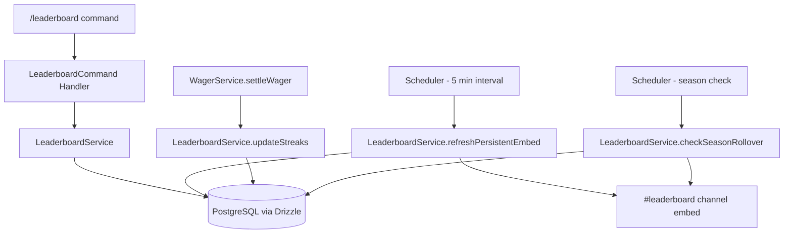

# Design Document: Leaderboard System

## Overview

This design replaces the existing minimal `handleLeaderboard` function in `src/bot/handler.ts` — which loads all users, loops through settled wagers per-user in application memory, and renders a plain text top-10 by wins — with a comprehensive leaderboard system. The new system introduces a dedicated `LeaderboardService` that computes rankings via SQL aggregation queries, supports five ranking categories (wins, earnings, win_rate, streak, reputation), four time windows (weekly, monthly, seasonal, all-time), per-game filtering, real/freeplay mode separation, streak tracking on wager settlement, seasonal resets with archival, a rich Discord embed response, player self-lookup, and a persistent auto-updating embed in a `#leaderboard` channel.

The system is built as a read-heavy query layer on top of the existing `wagers` and `users` tables, with two new tables (`seasons` and `season_archives`) and two new columns on `users` (`currentStreak` and `bestStreak`). No changes to the wager lifecycle are needed beyond hooking streak updates into the existing settlement flow.

## Architecture



The architecture follows the existing patterns in the codebase:

- **LeaderboardService** (`src/services/leaderboard.ts`): Pure service class handling all ranking queries, streak updates, season management, and embed building. Mirrors the pattern of `WagerService`, `ReputationService`, and `LobbyService`.
- **Command Handler**: A new `handleLeaderboard` function replaces the existing one in `src/bot/handler.ts`, accepting filter options and delegating to `LeaderboardService`.
- **Slash Command Update**: The existing `/leaderboard` command definition in `src/bot/commands.ts` is updated to include optional `category`, `period`, `game`, and `mode` string options.
- **Scheduler Integration**: Two new periodic tasks are added to `src/services/scheduler.ts`: persistent embed refresh (every 5 minutes) and season rollover check (once per tick).
- **Streak Hook**: `WagerService.settleWager` calls `LeaderboardService.updateStreaks(winnerId, loserId, mode, game)` after settlement.

## Components and Interfaces

### LeaderboardService

```typescript
// src/services/leaderboard.ts

export type RankingCategory = "wins" | "earnings" | "win_rate" | "streak" | "reputation";
export type TimeWindow = "weekly" | "monthly" | "seasonal" | "all-time";
export type GameFilter = "fifa" | "lol" | "valorant" | "rocketleague" | "cod" | "fortnite" | "other";
export type ModeFilter = "real" | "freeplay";

export interface LeaderboardFilters {
  category: RankingCategory;   // default: "wins"
  period: TimeWindow;          // default: "seasonal"
  game?: GameFilter;           // default: all games
  mode: ModeFilter;            // default: "real"
}

export interface PlayerStats {
  userId: string;
  username: string;
  rank: number;
  wins: number;
  losses: number;
  winRate: number;           // percentage 0-100
  earnings: number;          // net profit (winnings - losses)
  currentStreak: number;
  bestStreak: number;
  reputation: number;
  totalWagers: number;
}

export interface LeaderboardResult {
  entries: PlayerStats[];      // top 10
  userEntry?: PlayerStats;     // invoking user's stats (if not in top 10)
  filters: LeaderboardFilters;
  seasonNumber: number;
  seasonStartDate: Date;
}

export class LeaderboardService {
  /** Query top 10 players for the given filters */
  async getLeaderboard(filters: LeaderboardFilters, userId?: string): Promise<LeaderboardResult>;

  /** Update win/loss streaks after a wager settles */
  async updateStreaks(winnerId: string, loserId: string, mode: ModeFilter, game: string): Promise<void>;

  /** Check if the current season has ended and perform rollover */
  async checkSeasonRollover(): Promise<void>;

  /** Refresh the persistent embed in #leaderboard channel */
  async refreshPersistentEmbed(guildId: string): Promise<void>;

  /** Build a Discord embed for a leaderboard result */
  buildLeaderboardEmbed(result: LeaderboardResult): EmbedBuilder;

  /** Build the persistent multi-section embed (top 3 per category) */
  buildPersistentEmbed(seasonNumber: number, seasonStart: Date, guildId: string): Promise<EmbedBuilder>;

  /** Get the current season info */
  async getCurrentSeason(): Promise<{ seasonNumber: number; startDate: Date; endDate: Date }>;

  /** Archive final standings for a completed season */
  async archiveSeason(seasonNumber: number): Promise<void>;

  /** Compute a single player's stats for the given filters */
  async getPlayerStats(userId: string, filters: LeaderboardFilters): Promise<PlayerStats | null>;
}
```

### Updated Slash Command

```typescript
// Addition to src/bot/commands.ts — replace existing /leaderboard definition
new SlashCommandBuilder()
  .setName("leaderboard")
  .setDescription("See the top players")
  .addStringOption(opt => opt.setName("category").setDescription("Ranking metric")
    .addChoices(
      { name: "Wins", value: "wins" },
      { name: "Earnings", value: "earnings" },
      { name: "Win Rate", value: "win_rate" },
      { name: "Streak", value: "streak" },
      { name: "Reputation", value: "reputation" },
    ))
  .addStringOption(opt => opt.setName("period").setDescription("Time period")
    .addChoices(
      { name: "Weekly", value: "weekly" },
      { name: "Monthly", value: "monthly" },
      { name: "Seasonal", value: "seasonal" },
      { name: "All Time", value: "all-time" },
    ))
  .addStringOption(opt => opt.setName("game").setDescription("Filter by game")
    .addChoices(
      { name: "FIFA / EA FC", value: "fifa" },
      { name: "League of Legends", value: "lol" },
      { name: "Valorant", value: "valorant" },
      { name: "Rocket League", value: "rocketleague" },
      { name: "Call of Duty", value: "cod" },
      { name: "Fortnite", value: "fortnite" },
      { name: "Other", value: "other" },
    ))
  .addStringOption(opt => opt.setName("mode").setDescription("Wager mode")
    .addChoices(
      { name: "Real Money", value: "real" },
      { name: "Freeplay", value: "freeplay" },
    ))
```

### Streak Update Hook

In `WagerService.settleWager`, after the existing settlement logic:

```typescript
// After updating wager status to "settled"
await leaderboardService.updateStreaks(winnerId, loserId, wager.mode as ModeFilter, wager.game);
```

### Scheduler Additions

Two new methods in the `Scheduler.tick()`:

```typescript
await this.refreshLeaderboard();   // every 5 min
await this.checkSeasonRollover();  // every tick (30s), lightweight check
```

## Data Models

### New Tables

```typescript
// Addition to src/db/schema.ts

export const seasons = pgTable("seasons", {
  id: text("id").primaryKey(),                    // nanoid
  seasonNumber: integer("season_number").notNull().unique(),
  startDate: timestamp("start_date").notNull(),
  endDate: timestamp("end_date").notNull(),
  active: integer("active").notNull().default(1), // 1 = current, 0 = archived
  createdAt: timestamp("created_at").notNull().defaultNow(),
});

export const seasonArchives = pgTable("season_archives", {
  id: text("id").primaryKey(),                    // nanoid
  seasonNumber: integer("season_number").notNull(),
  category: text("category").notNull(),           // "wins", "earnings", "streak"
  rank: integer("rank").notNull(),
  userId: text("user_id").notNull().references(() => users.id),
  username: text("username").notNull(),
  value: integer("value").notNull(),              // the metric value at archive time
  archivedAt: timestamp("archived_at").notNull().defaultNow(),
}, (table) => [
  index("idx_season_archives_season").on(table.seasonNumber),
]);
```

### Schema Modifications

Add streak columns to the `users` table:

```typescript
// New columns on users table
currentStreak: integer("current_streak").notNull().default(0),
bestStreak: integer("best_streak").notNull().default(0),
```

### New Database Indexes

Add indexes to the `wagers` table for efficient leaderboard queries:

```typescript
// Additional indexes on wagers table
index("idx_wagers_settled_at").on(table.settledAt),
index("idx_wagers_winner").on(table.winnerId),
index("idx_wagers_game").on(table.game),
index("idx_wagers_mode").on(table.mode),
```

### Key SQL Query Patterns

**Wins ranking** (SQL aggregation, not in-memory):
```sql
SELECT w."winner_id" AS "userId", u."username",
       COUNT(*) AS "wins",
       (SELECT COUNT(*) FROM wagers w2
        WHERE (w2."creator_id" = w."winner_id" OR w2."opponent_id" = w."winner_id")
          AND w2."status" = 'settled' AND w2."winner_id" != w."winner_id"
          AND w2."mode" = $mode AND w2."settled_at" >= $startDate) AS "losses"
FROM wagers w
JOIN users u ON u.id = w."winner_id"
WHERE w."status" = 'settled'
  AND w."mode" = $mode
  AND ($game IS NULL OR w."game" = $game)
  AND w."settled_at" >= $startDate
GROUP BY w."winner_id", u."username"
ORDER BY "wins" DESC
LIMIT 10;
```

**Earnings ranking**:
```sql
SELECT u.id AS "userId", u."username",
       SUM(CASE WHEN w."winner_id" = u.id THEN w."amount" * 2 - w."fee" ELSE 0 END)
       - SUM(CASE WHEN w."winner_id" != u.id THEN w."amount" ELSE 0 END) AS "earnings",
       COUNT(*) AS "totalWagers"
FROM users u
JOIN wagers w ON (w."creator_id" = u.id OR w."opponent_id" = u.id)
WHERE w."status" = 'settled'
  AND w."mode" = $mode
  AND ($game IS NULL OR w."game" = $game)
  AND w."settled_at" >= $startDate
GROUP BY u.id, u."username"
ORDER BY "earnings" DESC
LIMIT 10;
```

**Win rate ranking** (minimum 5 wagers):
```sql
-- Same join pattern, with HAVING COUNT(*) >= 5
-- ORDER BY (wins::float / COUNT(*)) DESC
```


## Correctness Properties

*A property is a characteristic or behavior that should hold true across all valid executions of a system — essentially, a formal statement about what the system should do. Properties serve as the bridge between human-readable specifications and machine-verifiable correctness guarantees.*

### Property 1: Ranking sort order is correct for any category

*For any* ranking category and any set of player stats, the leaderboard entries returned by `getLeaderboard` SHALL be sorted in descending order by the metric corresponding to that category (wins → win count, earnings → net earnings, win_rate → win percentage with ≥5 wagers, streak → current streak, reputation → reputation score).

**Validates: Requirements 1.1, 1.2, 1.3, 1.4, 1.5**

### Property 2: Time window filtering excludes out-of-range wagers

*For any* time window and any set of settled wagers with varying settlement dates, the leaderboard results SHALL only reflect wagers whose `settledAt` falls within the specified window (weekly = last 7 days, monthly = last 30 days, seasonal = since season start, all-time = no date restriction). A wager settled outside the window SHALL NOT contribute to any player's stats.

**Validates: Requirements 2.1, 2.2, 2.3, 2.4**

### Property 3: Game and mode filters restrict included wagers

*For any* game filter and mode filter combination, the leaderboard results SHALL only reflect wagers matching both the specified game (or all games if unspecified) and the specified mode. A wager with a non-matching game or mode SHALL NOT contribute to any player's stats.

**Validates: Requirements 3.1, 3.2, 4.1, 4.2**

### Property 4: Streak update invariants on settlement

*For any* wager settlement with a winner and loser, after calling `updateStreaks`: the winner's `currentStreak` SHALL equal their previous `currentStreak + 1`, the loser's `currentStreak` SHALL equal `0`, and each player's `bestStreak` SHALL equal `max(previousBestStreak, newCurrentStreak)`.

**Validates: Requirements 5.1, 5.2, 5.3**

### Property 5: Cancellation and refund preserve streaks

*For any* wager that is cancelled or refunded, both players' `currentStreak` and `bestStreak` values SHALL remain unchanged from their values before the cancellation/refund.

**Validates: Requirements 5.5**

### Property 6: Category-specific embed entry contains all required fields

*For any* ranking category and any valid `PlayerStats` object, the formatted leaderboard entry string SHALL contain all fields required by that category: wins → (username, wins, losses, win rate), earnings → (username, earnings, total wagers), win_rate → (username, win rate, total wagers), streak → (username, current streak, best streak), reputation → (username, reputation score, tier name).

**Validates: Requirements 6.3, 6.4, 6.5, 6.6, 6.7**

### Property 7: Medal and rank formatting

*For any* leaderboard result with N entries (1 ≤ N ≤ 10), positions 1-3 SHALL be prefixed with medal emojis (🥇, 🥈, 🥉 respectively) and positions 4-N SHALL be prefixed with their numeric rank.

**Validates: Requirements 6.2**

### Property 8: Embed metadata reflects active filters

*For any* combination of ranking category, time window, game filter, and mode, the built embed's title or description SHALL contain the active category name, time window name, game name (if filtered), and mode label.

**Validates: Requirements 6.8, 4.4**

### Property 9: Self-lookup returns correct rank with same filters

*For any* user who has settled wagers but is not in the top 10, the `userEntry` in the `LeaderboardResult` SHALL have a `rank` value greater than 10 and SHALL be computed using the same filters (category, period, game, mode) as the main leaderboard entries.

**Validates: Requirements 8.1, 8.3**

### Property 10: Season duration is exactly 30 days

*For any* season start date, the computed season end date SHALL be exactly 30 days (30 * 24 * 60 * 60 * 1000 milliseconds) after the start date.

**Validates: Requirements 9.1**

### Property 11: Leaderboard result size is bounded

*For any* set of filters and any number of eligible players, the `entries` array in `LeaderboardResult` SHALL contain at most 10 elements and at least 0 elements.

**Validates: Requirements 6.1**

## Error Handling

| Scenario | Handling |
|---|---|
| No settled wagers match filters | Return embed with "No results found for the selected filters." message |
| User not in top 10 and has no matching wagers | Display "You have no results for these filters" in user stats section |
| `#leaderboard` channel doesn't exist | `refreshPersistentEmbed` silently skips (matches existing `postToNamedChannel` pattern) |
| Persistent embed message deleted | Service creates a new message on next refresh cycle |
| Database query timeout | Log error, return cached/empty result, don't crash the bot |
| Season table empty (first run) | `getCurrentSeason` creates Season 1 starting from current date |
| Invalid filter values | Slash command choices enforce valid values; no runtime validation needed |
| Streak update fails mid-settlement | Streak update is non-critical; log error, don't block settlement |

## Testing Strategy

### Property-Based Tests (fast-check, minimum 100 iterations each)

The project already uses `fast-check` and `vitest` (see `src/__tests__/lobby.property.test.ts`). Each correctness property above maps to one property-based test in `src/__tests__/leaderboard.property.test.ts`.

- **Library**: fast-check (already in devDependencies)
- **Runner**: vitest --run
- **Iterations**: 100 per property
- **Tag format**: `Feature: leaderboard-system, Property N: <title>`

Properties 1-3 test the pure ranking/filtering logic of `LeaderboardService` by generating random wager datasets and verifying sort order, time filtering, and game/mode filtering.

Properties 4-5 test streak update logic by generating random settlement sequences and verifying streak invariants.

Properties 6-8 test the embed formatting functions by generating random `PlayerStats` and filter combinations and verifying the output strings contain required fields.

Properties 9-11 test self-lookup, season duration, and result size bounds.

### Unit Tests

`src/__tests__/leaderboard.unit.test.ts`:

- Default filter values (category=wins, period=seasonal, mode=real)
- Empty leaderboard returns "No results" embed
- Win rate excludes players with <5 wagers (specific example)
- Self-lookup when user is in top 10 (no separate entry)
- Self-lookup when user has no matching wagers
- Season rollover creates archive and resets streaks
- Persistent embed includes "Last updated" timestamp
- Persistent embed has sections for wins, earnings, streak

### Integration Tests

- Scheduler calls `refreshPersistentEmbed` at 5-minute intervals
- Persistent embed recovery when message is deleted
- Season rollover triggered by scheduler
- Streak update called from `WagerService.settleWager`

### Mocking Strategy

Following the existing pattern in `lobby.property.test.ts`:
- Mock `db` (Drizzle query chains) to return controlled datasets
- Mock `walletService`, `reputationService` as needed
- Mock Discord.js `EmbedBuilder` for embed content assertions
- No real database or Discord API calls in property/unit tests
